# 🌦️ Flutter Weather App

A **modern weather application** built with Flutter that provides real-time weather updates, forecasts, and air quality information — all in a clean and user-friendly interface.

---

## ✨ Features

- 🌍 **Current Weather**: Real-time temperature, conditions, and location info  
- 📅 **7-Day Forecast**: Extended outlook with detailed data  
- ⏱️ **24-Hour Forecast**: Hourly temperatures displayed with interactive chart  
- 🏙️ **City Comparison**: Compare weather across up to 6 cities  
- 🌅 **Detailed Insights**: Sunrise/sunset, humidity, pressure, visibility  
- 📊 **Weather Trends**: Past 7 days data visualization  
- 🌫️ **Air Quality Index**: Live AQI with health recommendations  
- ⚙️ **Customizable Settings**: Choose units (°C/°F), themes, and notifications  

---

## 📸 Screenshots

### Home Screens
| Home 1 | Home 2 |
|--------|--------|
| 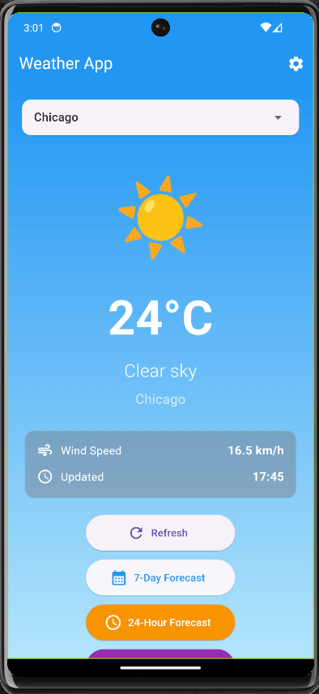 | 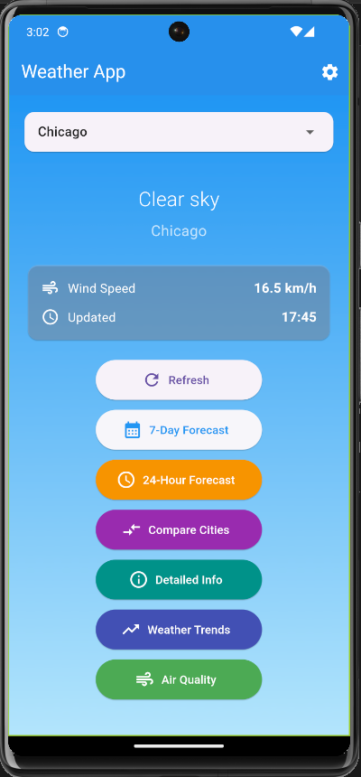 |

### Forecast
| 7-Day Forecast | 24-Hour Forecast 1 | 24-Hour Forecast 2 |
|----------------|------------------|------------------|
| 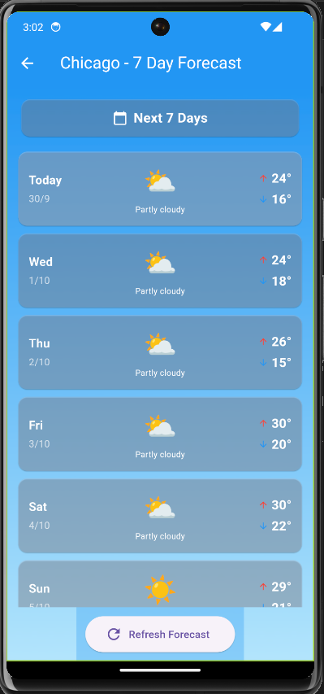 | 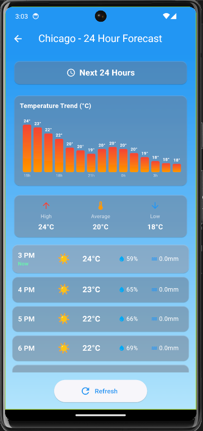 | 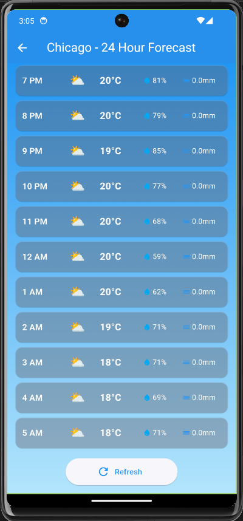 |

### Air Quality
| Air Quality 1 | Air Quality 2 |
|---------------|---------------|
| 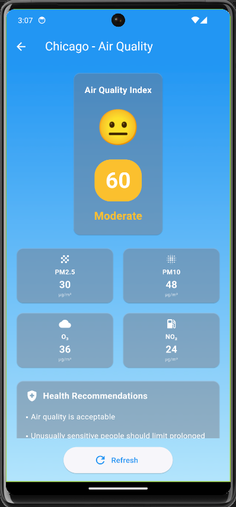 | 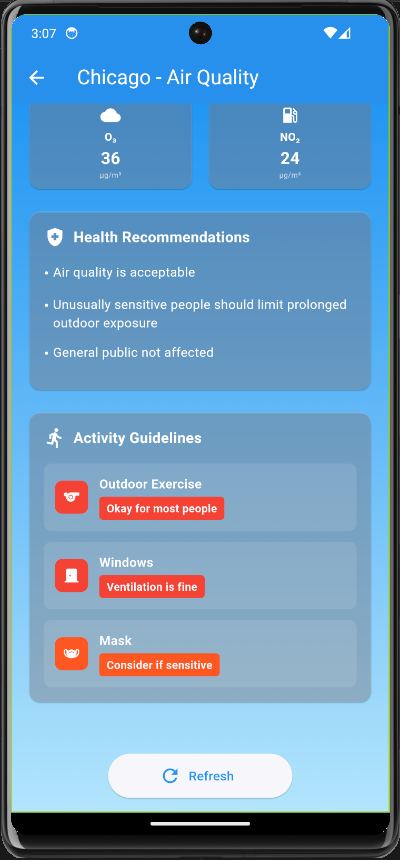 |

### City Comparison
| City Comparison |
|----------------|
|  |

### Detailed Info
| Detailed Info 1 | Detailed Info 2 |
|-----------------|----------------|
| 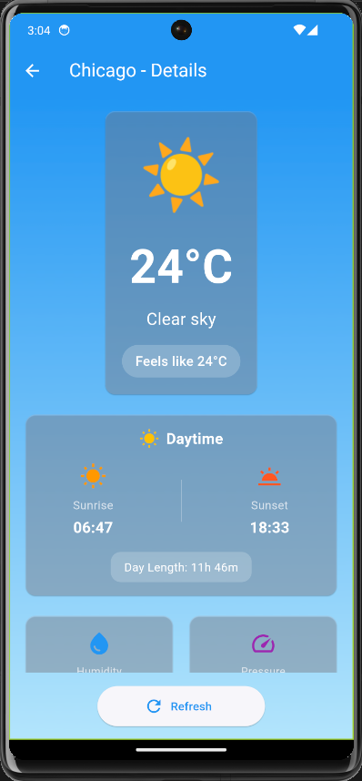 | 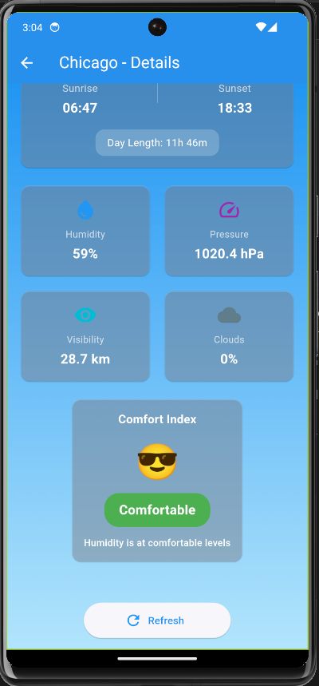 |

### Weather Trends
| Trend 1 | Trend 2 |
|---------|---------|
| 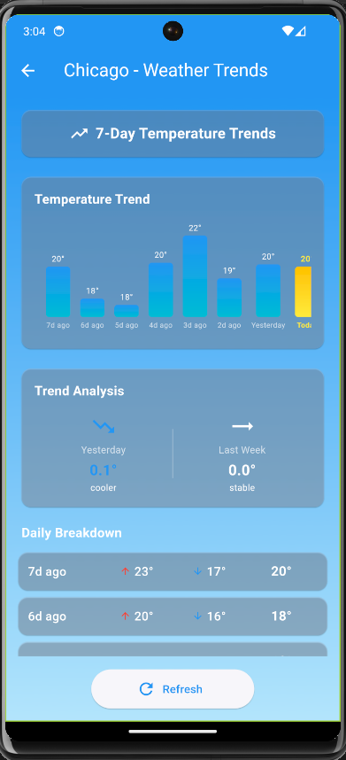 | 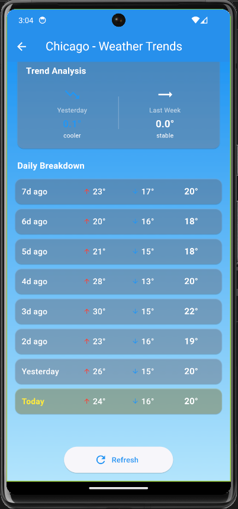 |


---

## 🛠️ Technologies Used

- **[Flutter](https://flutter.dev/)** – Cross-platform UI toolkit  
- **Dart** – Programming language  
- **[Open-Meteo API](https://open-meteo.com/)** – Free weather API  

---

## 🚀 Installation & Setup

1. **Clone the repository**
   ```bash
   git clone https://github.com/vibhav22022000/Flutter-Weather-App.git
   cd Flutter-Weather-App
````

2. **Install dependencies**

   ```bash
   flutter pub get
   ```

3. **Run the app**

   ```bash
   flutter run
   ```

---

## 📂 Project Structure

```
lib/
├── main.dart
├── screens/
│   ├── home_screen.dart
│   ├── forecast_screen.dart
│   ├── comparison_screen.dart
├── widgets/
│   ├── weather_card.dart
│   ├── forecast_chart.dart
├── services/
│   └── api_service.dart
```

---

## 🧑‍💻 Contributing

Contributions are welcome! If you’d like to improve this project:

1. Fork the repository
2. Create a new branch (`feature/your-feature`)
3. Commit your changes
4. Push to your fork
5. Submit a Pull Request

---

## 📜 License

This project is licensed under the **MIT License**.
Feel free to use, modify, and distribute it as per the license.

---

## 🙌 Acknowledgements

* [Open-Meteo API](https://open-meteo.com/) for weather data
* Flutter community for plugins & support

```

---

Do you want me to also add **shields.io badges** (like Flutter, License, Stars, Issues) at the top for a more professional GitHub look?
```
